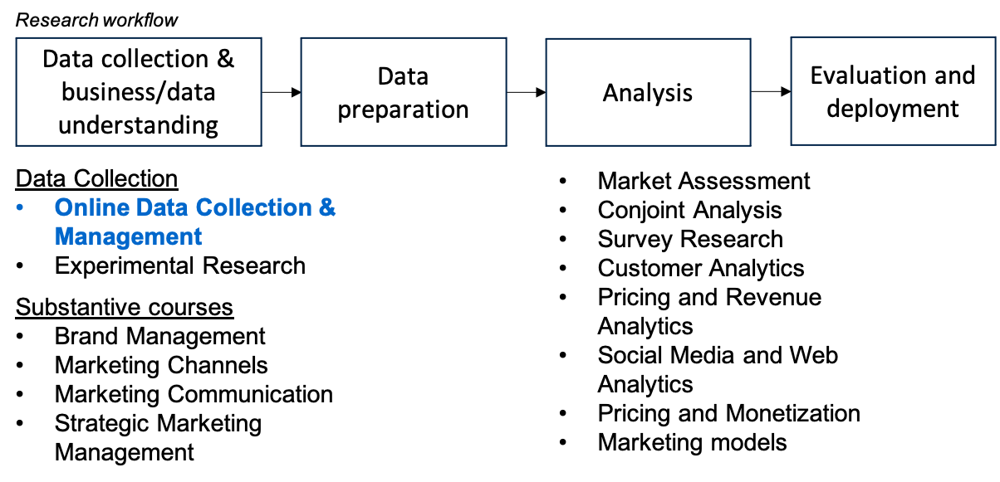
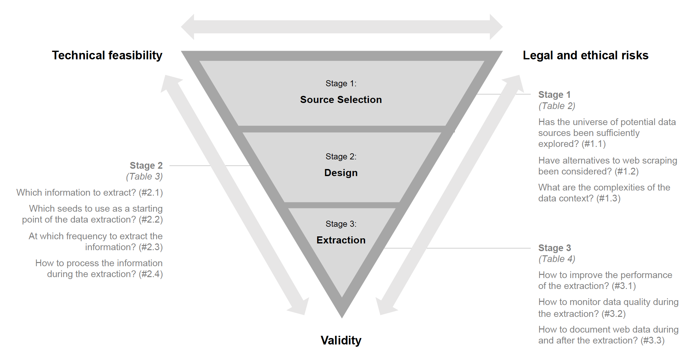

## Welcome to the final lecture in oDCM!

If you haven't done so, please **explore the exam page & example questions** on Canvas (updated!)

The __course evaluation__ will (soon) be live at https://app.evalytics.nl. Please voice your opinions!

## Agenda

- Course summary
- From here onwards
  - Recognizing limitations
  - Seizing research opportunities
- Course evaluation
- Exam preparation
- Remaining questions

## Positioning in the study program

# Course Summary

## Lessons learnt #1: Why to use web data?

- Research with web data can be more impactful than non-webdata-based research
  - Explore novel phenomena & be timely!
  - Boost ecological value, get closer to what managers use/consumers face!
  - Facilitate methodological advancement (e.g., text, images, video; e.g., using embeddings)
  - Better measurement through richer set of control variables
- But: challenging!
  - Programming skills to master technical challenges
  - Conceptual thinking to navigate design choices & legal risks
  
## Lessons learnt #2: Staying in balance

__Let's generate a few examples where validity, legal and technical goals conflicted in your projects.__

## Lessons learnt #3: Data Source Selection

- Important of "broadening horizon" (e.g., assume perspective of various stakeholders, exceed geographical boundaries, use aggregators vs. primary data providers)
- Consider alternatives to scraping (i.e., avoid defaulting! e.g., APIs, but also ready-made data sets); implications for *understanding and using API documentations* (e.g., picking endpoints, setting parameters, evaluating capabilities, navigating retrieval limits and error codes)
- Scope the data context (i.e., understand how the data is generated, assess reliability of the data, explore user conversations about the data, etc.); *often relevant for web scraping, as data isn't documented anywhere*

## Lessons learnt #4: Design Challenges (I)

- Hands-on-framework: Extraction, Looping, Timing, Infrastructure (Guyt et al. 2024)
- Look out for information - especially the "surprising ones!"; make use of tags and attribute-value pairs to locate information
- Look out for information (e.g., variables to compare to other studies), but also to see *time availability* differences (prompting *live vs. archival data collections*; e.g., due to wrong historical data or inaccurate timestamps)
- Spend time mapping your navigation path (e.g., how to get to information most efficiently?)
- Algorithmic biases present? Can exert control (e.g., through setting filters)?

## Lessons learnt #5: Design Challenges (II)

- Technical feasible sample size: How long does the data collection run? How many units (e.g., products, consumers) can be visited in a set number of hours? How much more "sleeping" can a scraper/API script do to stay below a retrieval limit?
- How to sample/seed? E.g., popularity-based, convenience based. And... to which population do the seeds generalize?
- At what frequency to extract the data (e.g., once? multiple times?; cf. live vs. archival data collections)
- How to process the data on-the-fly? (e.g., first store as JSON (often called `jsonl`), then parse)

## Lessons learnt #6: Design Challenges (III)

- Legal pillars
  - technical access barrier? (login walls, tokens, captchas, etc.)
  - intellectual property (IP) (not facts/figures, BUT: investment in structuring data (TDM); knows exceptions for research without opt-out; rightholders can opt out for firms)
  - ToS/contract (clickwrap, browsewrap, sign-in-wrap; enforceable with clear notice, professional use, scrapers benefited from service)
  - privacy (GDPR); triggered with any personal data (e.g., identifiers, profile URLs); sensitive data (e.g., biometric, health, financials); requires *lawful basis* (consent, contract, legal obligation, vital interests, public tasks, legitimate interest) --> data minimization, purpose limitation, security
  
## Lessons learnt #7: Design Challenges (IV)

- Lessons learnt from cases
  - hiQ vs. LinkedIn: *not* hacking, but break of contract (ToS) (clickwrap)
  - Clearview AI (face recognition software, triggered privacy but did not have lawful basis); public availability does not overwrite privacy regulation
  - Ryanair vs. PR Aviation: ToS, database right; database right did not apply, but ToS inforceable even with browsewrap
- How to mitigate legal risks?
  - Scientific purpose, and run by research institution?
  - Scale and scope? (all data vs. small sample? running time)
  - Location of data provider and users
  - "Go" decision from provider? Technical intrusiveness?
  - Data management & use, commercialization

## Lessons learnt #8: Extraction

- Prototyping is extremely important
  - `requests` + `beautifulSoup` vs. `selenium` (Chromedriver)
  - extraction methodology (e.g., tags, classes or other attributes, capturing `.get_text()` vs. the values of attributes) + stability of selectors
  - array misalignment (obey the hierarchy of stuff/how it is structured!!!)
  - scheduling (e.g., using `cron`), hiding passwords (e.g. with `.env`)
  - revise navigation paths
  - add comments to code (make it understandable for others, e.g., using ChatGPT)
- Start documentation from a readme template
  - Generate plots, descriptive stats
  - Think as a "data supplier" rather than narrowly focusing on *one* (research) question

<!--
## Lessons learnt #9: Web Scraping in Retailing

- Based on Guyt et al. 2024
- Research opportunities

- Challenges & Opportunities for Retail Scraping
  - Overcoming matching challenges and time alignment
  - LLMs for web scraping
-->

# Looking ahead...

## Recognizing Limitations

- Web data entails modeling challenges - not covered in this course (e.g., self-selection, endogeneity, "messy" data)
- Web data can't give you all (i.e., it *looks* l ike internal clickstream data, but it is not) 
- Legal and ethical issues not fully explored

## Potential Applications

- Collecting data for Master thesis
  - tell my colleagues you have the skills
  - start now, use later (data collection can take a long time!)
 
- PhD and research master students can "invest" into data collections
  - data was crucial to what I study

- Use automation skills (e.g., with OpenAI) in future employment

<!--
## Academic Opportunities from "what we study"

1. Scout out emerging phenomena 
2. Study phenomena that can't be captured otherwise (i.e., unobtrusively)
3. Study diverse populations (e.g., moving being *WEIRD*, more socio-economic backgrounds + geographies)
4. Generating realistic stimuli for experiments (e.g., brand logos)

## Academic Opportunities from "how we study" it

1. Unleashing real-time data collections (cf. historical)
2. Conduct & support field experiments with a platform's user base
3. Use APIs to *access algorithms*, rather than data (e.g., Google Cloud Vision, OpenAI)
4. Build own [research APIs](https://www.jstatsoft.org/article/view/v094i09)
5. Use aggregators & archive.org
-->

<!--
::: notes

  - e.g., new (?) format (live streams rather than lectures)
  - e.g., new content (e.g., Jupyter Notebooks rather than books)
  - ...
-->

# Practical Arrangements

## Projects & SPA

- Please hand in as if your data could be shared with others 
  - Take out any passwords (read in via `.env` instead, but do not share your `.env`!)
  - Remove any unnecessary files
  - Want to keep your names on the documentation or anonymize them? Choose.
  - Don't make statements that are too bold!
 
- Re-read the grading rubric

- You will receive __invite to self- and peer assessment__ via email

## Exam

- Organization
  - When: 18 December 
  - Work max. 2 hours on exam
  - Main sit and resit in block 2 (the 6 ECTS version has these two exam opportunities, given this course is taught once per academic year; the 3 ECTS version has a main/resit in block 2 and a main/resit in block 3, though without accompanying course work in block 3)
- How?
  - access to TestVision
  - access to Jupyter Notebook, Chrome (Edge does not have an inspect mode!)

## Exam tips

- I make selected resources available on the instruction page
  - tables/figures from Boegershausen et al. (2022)
  - tables/figures from Guyt et al. (2024)
  - all code from tutorials (Jupyter Notebooks)
  - collective cheatsheet: see [link](https://docs.google.com/document/d/1-Wm94h54ftJ8NDIHAbFoB-O3LeEF4eGlM_xi1delzUs/edit?usp=sharing), also on Canvas (deadline: 10 December 2025, 1pm).
- Internet is available; but: no use of sites/tools (e.g., ChatGPT), or Tilly.
  - STRICTLY follow the instructions on which sites to access.
  
## Exam technicalities

- You have access to a "Demo exam" on TestVision.
- Zipping/unzipping, plus... uploading the *correct* files!
- Need to walk through?

## Exam content

- all available in dedicated "example questions" document on Canvas
- expect new websites (for scraping) & investigate tags/attribute-value pairs, new endpoints/parameters of APIs, use of Selenium for clicking/scrolling/...

<!--
## Exam tips

- Practice scraping an unknown website
  - e.g., tutorials at tilburgsciencehub.com, 
  - working with music-to-scrape.org, tilburg.ai
  - focus on "category overview pages" & array misalignment -- the scraper will account for a large share of your grade
- You will be asked to use `selenium` for some subquestions; `BeautifulSoup` will be the base
- Cover "Fields of Gold" (2022), including the web appendix, sample size calculations and legal concerns (+ reason through challenges) + Guyt et al. 2024 (J. of Retailing) 
-->

## Next steps: Official course evaluation

- Course evaluation has been immensely important to this course
  - This edition: updated tutorials, added OpenAI (API advanced), refined feedback on coaching support
  - Last editions: TA support for coaching, new computer setup session, computer lab sessions, developed Journal of Retailing (2024) paper with hands-on guide to scraping, moved exam to campus, built music-to-scrape.org
- Course evaluation has been critical to my career
  - Without my past evaluations, I wouldn't be teaching to you today
  - I will look at all comments
  - Scores are most important to show importance of this course
- You will be invited via [Evalytics](https://app.evalytics.nl/)

## Informal feedback

<!--
- how to ease onboarding?
- how to make sure all software (including Chromedriver is installed)?
- Feel you've got enough support?
-->

## Stay in touch!

- WhatsApp! +31 13 466 8938
- [LinkedIn](https://www.linkedin.com/in/hannes-datta/)
- [YouTube](https://www.youtube.com/c/hannesdatta)

