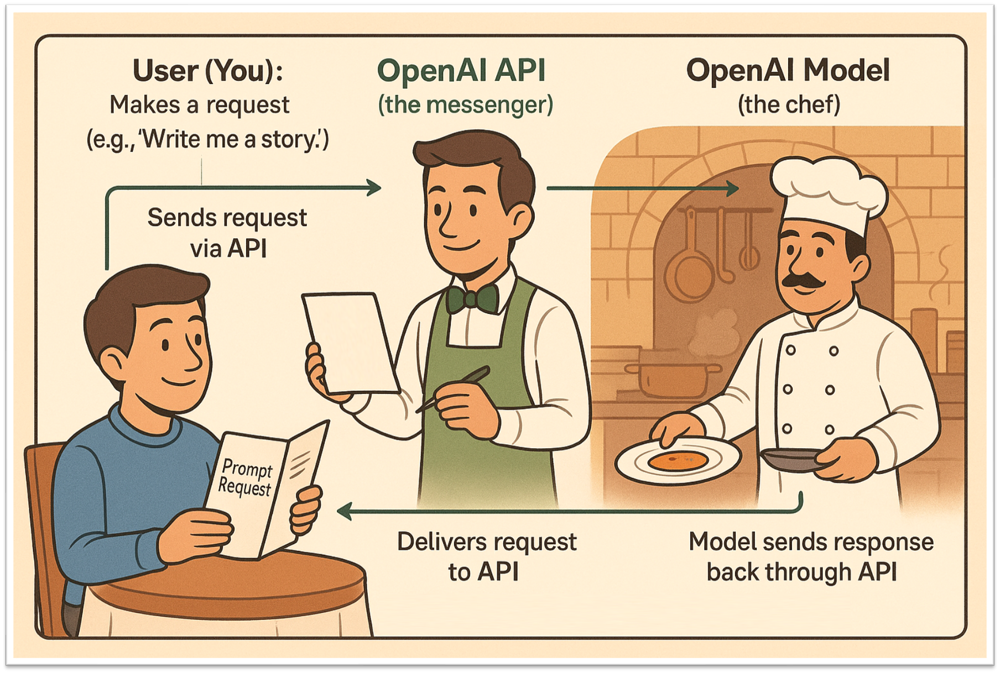
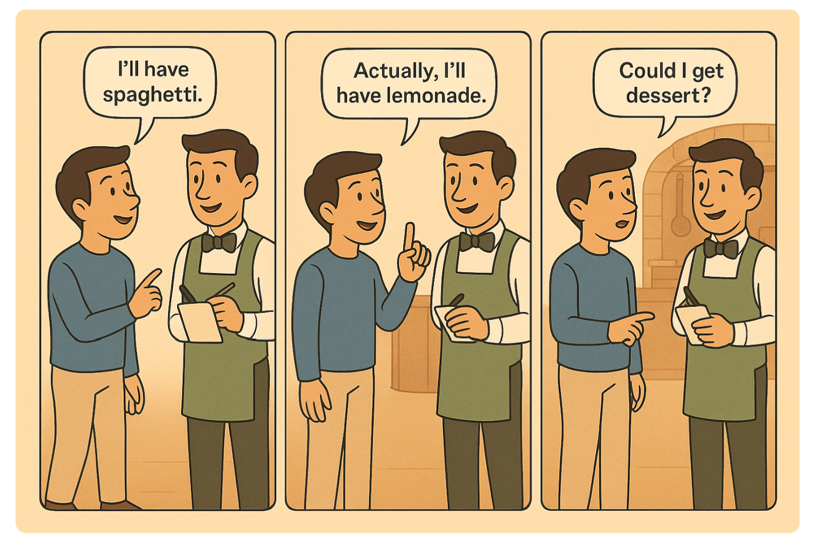
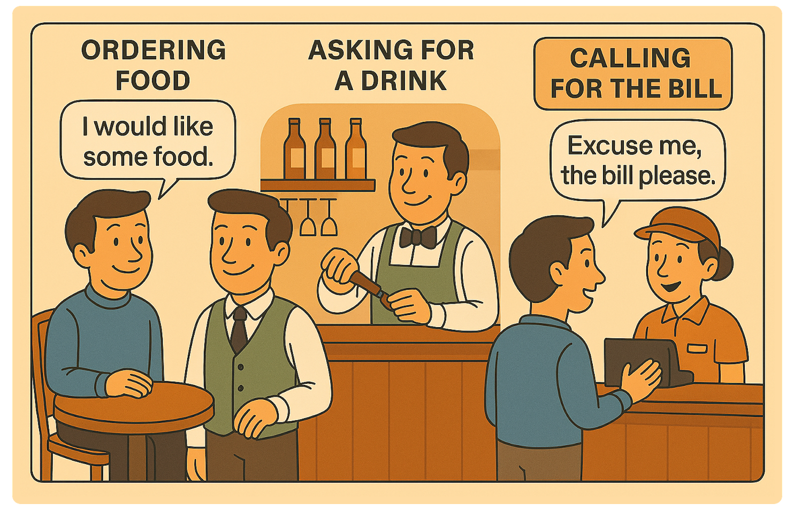

```{r setup, include=FALSE}
knitr::opts_chunk$set(echo = TRUE)
library(usethis)
library(tidyverse)
library(glue)
```

## Introduction

Welcome to the **OpenAI API Workshop**.

In this session, we'll start with a brief introduction to APIs and go over some essential programming tools. We'll use a simple analogy to help explain how different models in the OpenAI API work, and we'll carry that analogy throughout the workshop.

You'll learn the building blocks for using generative AI in research. We'll also cover important topics like data privacy and security when working with AI tools.

By the end of this workshop, you will be able to:

- Create an OpenAI account and set up your API key
- Understand how to send and receive requests using the OpenAI API
- Use different models such as text generation-, speech-, and embeddings models
- Be aware of costs, limitations, and ethical considerations

Let's get started.

---

## Prerequisites

Before joining the workshop, make sure you have the following ready:

- A free [OpenAI account](https://platform.openai.com/signup)
- A code editor installed on your computer, such as:
  - **RStudio** – [Install guide via Tilburg Science Hub](https://tilburgsciencehub.com/topics/computer-setup/software-installation/rstudio/r/)
  - **Visual Studio Code (VS Code)** – [Install guide via Tilburg Science Hub](https://tilburgsciencehub.com/topics/Computer-Setup/software-installation/IDE/vscode/)

---

## First OpenAI API Call

We'll start with the most basic way to make an API call to OpenAI's GPT model. To help explain how this works, we'll use a simple restaurant analogy:

- **You (Customer):** The person making the request  
- **OpenAI API (Waiter):** The messenger that takes your request to the AI  
- **GPT Model (Chef):** The system that processes your request and creates the response



### What We'll Do

1. Set up the connection to OpenAI (like finding a restaurant)
2. Create a simple prompt (like placing an order)
3. Get the response (like receiving your meal)

This is the simplest form of an API call — no streaming, no advanced settings — just a basic request and response.

---

### Setting Up Your API Key

Before making your first API call, follow these steps (**Need help seeing it in action?** Watch the video [walkthrough](video/workshop-API-key.mp4)):

1. **Get Your API Key**
  - Use the following [link](https://platform.openai.com/api-keys) and login  
  - Click `Create new secret key`  
  - Copy the key  
    - It looks like this: "sk-..." (keep it safe! You retrieve it only once!)

2. **Option A: Using RStudio (recommended)**
In RStudio, go to the Console pane (bottom left). Type and run this command:
```
usethis::edit_r_environ()
```
A new file will open in the top-left editor pane (your .Renviron file).
If it’s empty, that’s okay!

3. **Store your API key securely:**
Add this line to the file, replacing `sk-xxx...` with your real key:

```
OPENAI_API_KEY=sk-...your-key-here...
```

4. **Save and close the file:**
Press Save (Ctrl + S or Cmd + S).
Now go to the top menu bar and click `Session → Restart `R.
`.Renviron` runs every time R starts, your key will be automatically loaded into memory!

5. **Access Your Key in R Code**
In the Console, type: `Sys.getenv("OPENAI_API_KEY")`, Press Enter.
You should now see your API key appear in the top-right “`Environment`” tab as a variable under `Values.`
If you only see `""`, check if you restarted R correctly and saved the file.

To access your key in a RMarkdown file, use:
```{r set API key}
api_key <- Sys.getenv("OPENAI_API_KEY")
```

Now you're ready to use the OpenAI API securely in your code!

### API Call
We have our access (reservation = API Key) to the restaurant!

From here, we can place our order (prompt) and see what the chef (the model) sends us back. 
Let's make a simple API call now to see how everything comes together.

1. Set up the connection to OpenAI (like finding a restaurant)  
2. Create a simple prompt (like placing an order)  
3. Get the response (like receiving your meal)

This is the simplest form of an API call — no streaming, no advanced parameters — just a basic request and a direct response.

```{r install_openai, echo=FALSE, message=FALSE, warning=FALSE}
# install.packages("openai")  # Uncomment to install
```

```{r first_api_call}
# Waiter: This is the OpenAI API. You talk to it using the 'openai' R package.
library(openai)

# Load the API key from the environment
api_key <- Sys.getenv("OPENAI_API_KEY")

# Customer: This is YOU (or your app). You decide what to ask.
prompt = "Who is George Knox (PhD)?"

# Chef: This is the AI model (like GPT-4). It prepares the response based on your request.
response = create_chat_completion(
  model = "gpt-4o-mini",
  messages = list(
    list(role = "user", content = prompt)
  ),
  temperature = 1
)

# The response is delivered back to the customer (you)
result <- response$choices$message.content
cat("🧠 Response from the AI (Chef):\n\n")
cat(result, "\n")
```

## Basic Principles

### Looping — _“Ordering Again and Again”_

#### In the Restaurant Metaphor:

Imagine you're really hungry and want to **order multiple dishes**, one after another:

* First: you ask for spaghetti.
* Then: you ask for a drink.
* Then: dessert.

That’s **looping**, doing something **over and over again**, usually **with slight changes**.



##### In Programming/API Terms:

Looping is when your program:

* Sends **multiple API requests** in a row.
* Often in a **`for` loop** or a **`while` loop**.
* Each request might ask a different question or use different data.

**Why It’s Useful:**
* Process a list of texts automatically (e.g., summarizing 100 articles).
* Translate a batch of messages.
* Chat with the model in turns.


**A Quick Look at Loops in R** - Before we start sending multiple questions to the API, let’s look at how R handles **repeating tasks** on a dataset using a loop.
Here’s a dataset with (imaginary) restaurant reviews. Instead of writing separate code for each one, we can use a **`for` loop** to go through them one by one:

```{r loop_basics}
# Basic R loop — no API yet
reviews <- tibble(
  review = c(
    "The pasta was perfectly al dente, but the service felt rushed.",
    "A cozy spot with incredible sushi and a relaxed atmosphere.",
    "Overpriced for the portion size, though the flavors were outstanding.",
    "The waiter remembered our names and made the evening feel special.",
    "The burger was juicy, but the fries were soggy and cold."
  )
)

for (i in seq_len(nrow(reviews))) {
  cat("Pretend we're asking the AI to text-analyze...", "\n")
  r = reviews$review[i]
  cat(paste("   Review:", r),"\n")
  cat("\n")  
}
  
```
**This loop**:
- Goes through the vector of reviews
- Stores each review temporarily in the variable `r``
- Prints a message as if we were sending it to the AI

This is the exact kind of structure we’ll use when sending **multiple prompts** to the OpenAI API — but for now, we’re just printing the questions to get used to the idea!

**Looping the OpenAI API -**
Now that we're comfortable with concept of loops, let's send multiple questions to the OpenAI API using a `for` loop, just like placing several orders at a restaurant. We may want to spend time together to think about a good prompt to text-analyze reviews. For example:

> Read the following restaurant review and rate the overall emotional tone on a scale from 1 to 5, 
> where 1 = very negative, 3 = neutral, and 5 = very positive.
> Return only the number.
> Review: [INSERT REVIEW TEXT HERE]

```{r loop_with_api}
reviews <- tibble(
  review = c(
    "The pasta was perfectly al dente, but the service felt rushed.",
    "A cozy spot with incredible sushi and a relaxed atmosphere.",
    "Overpriced for the portion size, though the flavors were outstanding.",
    "The waiter remembered our names and made the evening feel special.",
    "The burger was juicy, but the fries were soggy and cold."
  ),
  emotional_score_gpt = NA
)

prompt_template <- "Read the following restaurant review and rate the overall emotional tone on a scale from 1 (very negative) to 5 (very positive). Return only the number.\nReview: %s"


for (i in seq_len(nrow(reviews))) {
  cat(paste0("Iteration ", i, "...\n"))
  review_prompt <- glue(prompt_template, reviews$review[i])

  response <- create_chat_completion(
    model = "gpt-4o-mini",
    messages = list(
      list(role = "user", content = review_prompt)
    ),
    temperature =  0
  )
  
  reviews$emotional_score_gpt[i] <- response$choices$message.content
}

```

Here's what's happening:
1. **We loop through each review** using `for (i in seq_len(nrow(reviews)))`.
2. For each one:
   - We **print the current iteration**
   - We **send the "master prompt" (`prompt_template`) and insert the review `reviews$review[i]` together to the model** using `client.responses.create(...)` ("the chef gets to work").
   - We **get the answer** from `response.output_text` ("the waiter brings the dish back").
   - Then we **add the AI's reply** to our data set.

Just like a waiter taking multiple orders and delivering dishes one at a time, this loop helps us ask several things without repeating our code over and over!

**[WARNING]:** Keep in mind that the API does **not** 'remember' your previous question.

```{r memory demo}
# Demonstrating that the API does NOT have memory between calls

# First call: ask a question
response1 <- create_chat_completion(
    model = "gpt-4o-mini",
    messages = list(
      list(role = "user", content = "My favorite color is blue.")
    ),
    temperature = 0
  )
cat("First response:","\n")
cat("Answer:", response1$choices$message.content, "\n\n")
  
# Second call: refer to the previous message, but without context
response2 <- create_chat_completion(
    model = "gpt-4o-mini",
    messages = list(
      list(role = "user", content = "What is my favorite color?")
    ),
    temperature = 0
  )
cat("Second response (no memory):","\n")
cat("Answer:", response2$choices$message.content, "\n\n")
```
---

## Endpoints — _“Different Sections of the Menu”_

### In the Restaurant Metaphor:

In the restaurant, instead of asking the waiter for everything, you talk to **different workers** for **different tasks**:

You tell the waiter what food you want.  
You ask the bartender for a drink.  
You call the cashier to pay the bill.  

Each worker has a specific job, and you contact the right one depending on what you need.

That's what an **endpoint** is in programming:  
It’s a specific address or route that does one job, like generating text, images, embeddings, transcripts, etc...  You "go" to the right endpoint, and it gives you exactly what you asked for.


### In API Terms:

An **endpoint** is a **URL** where you send your request.

For example, with the OpenAI API:

* `https://api.openai.com/v1/responses` → Talk with ChatGPT, like we just did
* `.../embeddings` → Turn text into numbers (useful for search, comparison of complex texts).
* `.../images/generations` → Generate images from text.
* `.../audio/speech` → Create speech
* `.../audio/transcriptions` → Create transcriptions
* `.../audio/translations` → Create translations

Each one does **something different**, but they all follow the same rules of ordering.

```{r, include = T}
library(httr)
library(jsonlite)
library(caTools)

# Get your API key
api_key <- Sys.getenv("OPENAI_API_KEY")

# Create output directory for images
output_dir <- "product_images"
if (!dir.exists(output_dir)) {
  dir.create(output_dir)
}

# Base prompt for the marketing image
base_prompt <- "A studio photo of a can of sparkling water, on a minimalist background, professional lighting, high-quality product photography, marketing style"

# Slightly varied prompts (simulate A/B test variants)
prompts <- c(
  paste(base_prompt, "— blue packaging with silver logo"),
  paste(base_prompt, "— green packaging with a lemon slice"),
  paste(base_prompt, "— pink packaging with a berry illustration")
)

for (i in seq_along(prompts)) {
  cat("\n🪄 Generating variant", i, "...\n")
  
  response <- POST(
    url = "https://api.openai.com/v1/images/generations",
    add_headers(
      Authorization = paste("Bearer", api_key),
      `Content-Type` = "application/json"
    ),
    body = toJSON(list(
      model = "gpt-image-1",
      prompt = prompts[i],
      size = "1024x1024",
      n = 1
    ), auto_unbox = TRUE)
  )
  
  # Parse response
  res_content <- content(response, as = "parsed")
  
  if (!is.null(res_content$error)) {
    cat("❌ Error:", res_content$error$message, "\n")
    next
  }
  
  # Extract image safely
  img_data <- res_content$data[[1]]$b64_json
  
  if (is.null(img_data) || !is.character(img_data)) {
    cat("❌ Invalid response (no base64 data) for variant", i, "\n")
    next
  }
  
  # Decode and save
  image_file <- file.path(output_dir, paste0("product_variant_", i, ".png"))
  writeBin(base64decode(img_data, what='raw'),con=image_file)
  
  cat("✅ Saved generated image:", image_file, "\n")
}

cat("\n🎨 All available product variants are saved in the 'product_images/' folder.\n")

```

#### Speech Endpoint — Text to Audio with Different Voices

In this example, we use the OpenAI **Text-to-Speech (TTS)** API to convert a line of text into spoken audio using multiple voices.
```{r speech_api_loop}
library(httr)

# Define the voices you want to use
voices <- c("echo", "nova", "shimmer")

# Text to convert to speech
input_text <- "Today, we are testing the OpenAI API. At the moment, we are testing the audio API, during a workshop of tilburg.ai"

# Get your API key from environment variable
api_key <- Sys.getenv("OPENAI_API_KEY")

# Create output directory if it doesn't exist
output_dir <- "audio"
if (!dir.exists(output_dir)) {
  dir.create(output_dir)
}

# Loop through each voice and generate the speech
for (voice in voices) {
  
  # Define the output file path
  speech_file <- file.path(output_dir, paste0("speech_", voice, ".mp3"))
  
  # Make POST request to OpenAI's speech endpoint
  response <- POST(
    url = "https://api.openai.com/v1/audio/speech",
    add_headers(
      Authorization = paste("Bearer", api_key),
      `Content-Type` = "application/json"
    ),
    body = list(
      model = "tts-1",       # You can also try "tts-1-hd"
      voice = voice,         # Voice: echo, nova, shimmer, etc.
      #langauge="nl",
      input = input_text     # The text you want converted to audio
    ),
    encode = "json",
    write_disk(speech_file, overwrite = TRUE)  # Save output directly to file
  )

  cat("Saved speech to: ", speech_file,"\n")
}
```
**What this does**:
- **Loops** through 3 voice options: `echo`, `nova`, and `shimmer`
- Sends the `input_text` to **OpenAI's speech endpoint**
- Streams the audio response and saves it as an `.mp3` file (one per voice)
- Files will be saved in: `audio/speech_echo.mp3`, `audio/speech_nova.mp3`, etc.

#### Using the Transcription Endpoint — Speech to Text

Now that we’ve generated speech, let’s try the opposite: **transcribing audio back into text** using OpenAI’s transcription API.

```{r transcribe_audio}
audio_file_path <- "audio/speech_echo.mp3"

# Using the transcription endpoint
response <- POST(
  url = "https://api.openai.com/v1/audio/transcriptions",
  add_headers(
    Authorization = paste("Bearer", api_key)
  ),
  body = list(
    model = "whisper-1",
    file = upload_file(audio_file_path, type = "audio/mp3"),
    #language="nl"
    prompt = "Everytime you hear Tilburg AI, note it as Tilburg.ai"
  )
)

cat("Transcript:\n", content(response)$text, "\n")
```

**What this does:**
- Loads the previously generated audio file (from the `echo` voice)
- Sends it to OpenAI’s transcription model (`gpt-4o-transcribe`)
- Optionally, you can:
  - Specify the language with `language="nl"` for Dutch
  - Add a custom prompt to guide transcription formatting
  
### Embeddings Endpoint

**What Are Embeddings?**

Embeddings are a way to turn text (words, sentences, or even whole documents) into numbers so that computers can understand and work with them. Each piece of text is converted into a long list of numbers (called a _vector_) that captures its meaning and context.

- **Why are embeddings useful?**
  - They let computers compare how similar two pieces of text are (e.g., "cat" and "kitten" will have similar embeddings).
  - They are used for search, recommendations, clustering, and many other AI tasks.
  - Embeddings make it possible to do math with language, like finding analogies or grouping similar ideas together.

In the OpenAI API, you can use the embeddings endpoint to get these number representations for your text.

```{r embeddings_example}
library(httr)
library(jsonlite)

# Text to embed
input_text <- "The food was delicious and the waiter..."

# Make the POST request to the embeddings endpoint
response <- POST(
  url = "https://api.openai.com/v1/embeddings",
  add_headers(
    Authorization = paste("Bearer", api_key),
    `Content-Type` = "application/json"
  ),
  body = toJSON(list(
    model = "text-embedding-ada-002",
    input = input_text,
    encoding_format = "float"
  ), auto_unbox = TRUE)
)

embedding <- content(response, as = "parsed")$data[[1]]$embedding

# Print the first 50 floats
first_50 <- embedding[1:50]

cat("🔢 First 50 values of embedding:\n")
cat(sprintf("%.6f", first_50), sep = ", ")
cat("\n")
  
# Print total length of the embedding
cat("\nThe embedding is a list of", length(embedding), "floats\n")

```

__Application 1: Search__

We first demonstrate how embeddings can power semantic search — finding the most relevant products or reviews for a user query, even if they don’t use the same words.
In marketing, this is how recommender systems and search ranking models find “conceptually similar” products.

We’ll embed short product descriptions (e.g., marketing text for snacks).

```{r}
products <- tibble::tibble(
  product_id = 1:5,
  description = c(
    "Crispy organic chips made with sea salt and olive oil",
    "High-protein energy bar with peanut butter flavor",
    "Low-fat yogurt with real fruit pieces",
    "Dark chocolate bar with almonds",
    "Gluten-free granola with honey and nuts"
  )
)

library(dplyr)
library(purrr)

get_embeddings <- function(input_text) {
    
  # Make the POST request to the embeddings endpoint
  response <- POST(
    url = "https://api.openai.com/v1/embeddings",
    add_headers(
      Authorization = paste("Bearer", api_key),
      `Content-Type` = "application/json"
    ),
    body = toJSON(list(
      model = "text-embedding-ada-002",
      input = input_text,
      encoding_format = "float"
    ), auto_unbox = TRUE)
  )
  
  embedding <- content(response, as = "parsed")$data[[1]]$embedding
  
  Sys.sleep(.5) # for rate limits
  
  return(embedding)
}

# Call the API
products <- products %>%
  mutate(embedding = map(description, get_embeddings))
```

We can now "simulate" queries, as if they come from consumers typing for “healthy breakfast snack” into a search box.

```{r}
query <- "healthy breakfast snack"
query_emb <- get_embeddings(query)

cosine_similarity <- function(a, b) {
  a <- unlist(a)
  b <- unlist(b)
  sum(a * b) / (sqrt(sum(a^2)) * sqrt(sum(b^2)))
}
# Rank products by similarity to query
products_ranked <- products %>%
  mutate(similarity = map_dbl(embedding, ~ cosine_similarity(., query_emb))) %>%
  arrange(desc(similarity))

products_ranked %>%
  select(description, similarity)
```

We can try the same for another query, say... "I love pringles."


```{r}
query <- "i love pringles"
query_emb <- get_embeddings(query)

cosine_similarity <- function(a, b) {
  a <- unlist(a)
  b <- unlist(b)
  sum(a * b) / (sqrt(sum(a^2)) * sqrt(sum(b^2)))
}

# Rank products by similarity to query
products_ranked <- products %>%
  mutate(similarity = map_dbl(embedding, ~ cosine_similarity(., query_emb))) %>%
  arrange(desc(similarity))

products_ranked %>%
  select(description, similarity)
```

__Application 2__

We can also use embeddings to automatically code open-ended survey responses — one of the most tedious tasks in marketing research.
Instead of manual categorization, responses are embedded and matched to pre-defined themes.

```{r}

responses <- tibble::tibble(
  id = 1:7,
  text = c(
    "I love how convenient the app is when ordering food.",
    "It’s too expensive for what you get.",
    "Customer service was very friendly and helpful.",
    "Takes too long to deliver during lunch hours.",
    "Lots of healthy options to choose from!",
    "The design looks modern and clean.",
    "I hated this place - it reminded me of my least favorite fast food chain."
  )
)

themes <- tibble::tibble(
  theme = c("Convenience", "Price", "Service", "Speed", "Healthiness", "Design"),
  description = c(
    "The ease and simplicity of using the product or service.",
    "The affordability and value for money of the product.",
    "The helpfulness and friendliness of staff or support.",
    "The quickness of delivery or response times.",
    "The health benefits or nutritious qualities.",
    "The aesthetic or visual appeal of the product."
  )
)


responses <- responses %>%
  mutate(embedding = map(text, get_embeddings))

themes <- themes %>%
  mutate(embedding = map(description, get_embeddings))

normalize <- function(x) {
  x <- unlist(x)
  x / sqrt(sum(x^2))
}

responses <- responses %>%
  mutate(embedding_norm = map(embedding, normalize))

themes <- themes %>%
  mutate(embedding_norm = map(embedding, normalize))

cosine_similarity <- function(a, b) {
  a <- unlist(a)
  b <- unlist(b)
  sum(a * b) / (sqrt(sum(a^2)) * sqrt(sum(b^2)))
}

# Match each response to its closest theme
matches <- responses %>%
  mutate(
    best_match = map_chr(
      embedding,
      function(resp_emb) {
        sims <- map_dbl(themes$embedding, ~ cosine_similarity(resp_emb, .x))
        themes$theme[which.max(sims)]
      }
    )
  ) %>%
  select(id, text, best_match)

matches

```


## Tokens — “How Much You’re Saying”

### In the Restaurant Metaphor:

Imagine you're paying **per word** of your order instead of per item.

Saying:

> “I want spaghetti.”

...costs fewer tokens than:

> “Hello kind waiter, I would like a steaming plate of your finest spaghetti, with extra parmesan on top, please.”

The **longer** or more **complex** your request, the **more tokens** it costs.


### In OpenAI Terms:

- **Tokens = Small chunks of text**, usually a word or part of a word.
- Examples:
  - `"Hello"` → 1 token  
  - `"Artificial intelligence is amazing!"` → ~5 tokens


**Why Tokens Matter:**

- You **pay per token** — for both **input** (your prompt) and **output** (the AI’s reply).
- Each model has a **maximum token limit per request**  
  _(e.g., GPT-4o supports up to ~128,000 tokens)._
- **Shorter, clearer prompts** = faster, cheaper, and often better results.

📌 **Takeaway**: Think of tokens like paying by the word — be thoughtful, but concise!

```{r token_usage_example}
library(httr)
library(jsonlite)

# Define the prompt
prompt <- "Explain API calls in simple terms, using the customer - waiter - chef metaphor."

# API key from environment
api_key <- Sys.getenv("OPENAI_API_KEY")

# Make the API call
response <- POST(
  url = "https://api.openai.com/v1/chat/completions",
  add_headers(
    Authorization = paste("Bearer", api_key),
    `Content-Type` = "application/json"
  ),
  body = toJSON(list(
    model = "gpt-4",
    messages = list(list(role = "user", content = prompt)),
    temperature = 0.7
  ), auto_unbox = TRUE)
)

result <- content(response, as = "parsed")

output_text <- result$choices[[1]]$message$content
cat("Output:\n", output_text, "\n\n")

# Show token usage
usage <- result$usage
cat("Token usage:\n")
cat("Input tokens: ", usage$prompt_tokens, "\n")
cat("Output tokens:", usage$completion_tokens, "\n")
cat("Total tokens: ", usage$total_tokens, "\n")
```

```{r cost_calculation}
# Add cost calculation, $2.00 / 1M input tokens, $8.00 / 1M output tokens
cost_per_million_input_tokens = 2
cost_per_million_output_tokens = 8

total_cost <- (usage$prompt_tokens / 1000000) * cost_per_million_input_tokens + (usage$completion_tokens / 1000000) * cost_per_million_output_tokens

cat("\n","Total cost ($):", total_cost)
```

---

## Wrapping Up — What We've Learned

In this workshop, we walked through the all the steps needed to interact with OpenAI's API, from the basics to more advanced use cases.

### Topics We Covered:

- What an API is, and how OpenAI's API works
- Why and how to securely use your **API key** with a `.Renviron` file
- Making your **first API call** using a simple prompt
- Looping over multiple questions using Python
- Used different endpoints:
  - Using **speech synthesis** (text-to-audio) and **transcription** (audio-to-text)
  - Used an **embedding** model
- Understanding **tokens** — how pricing and length work
- Case study of using **embeddings** to find semantically similar scientific texts
